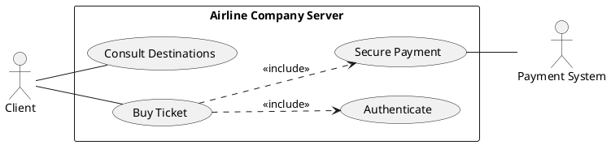
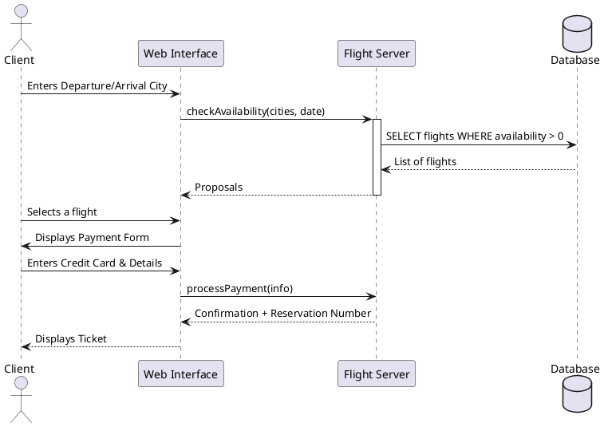

# 🏆 MASTER CORRECTION: MOCK EXAM 1 (SUBJECT 1)
**Theme: Aviation Management & Jersey Marketplace**
**Objective: 50/50 points (Total Success)**

---

## 🧠 PART A: THEORY AND CONCEPTS (10 Points)

1. **Technical Definitions:**
   - **HTML (HyperText Markup Language):** Markup language used to structure the content of a web page (headings, paragraphs, images).
   - **URL (Uniform Resource Locator):** Unique address used to locate a resource on the internet (e.g., https://www.google.com).
   - **CSS (Cascading Style Sheets):** Styling language used to manage formatting and design (colors, fonts, responsiveness).
   - **CMS (Content Management System):** Software used to create and manage a website without coding (e.g., WordPress, PrestaShop).

2. **Internet Services:** Web (Browsing), Electronic Mail (Email), File Transfer (FTP), Instant Messaging.
3. **Website & Examples:** A set of linked web pages accessible via a domain name. *Examples: Amazon.com, Wikipedia.org.*
4. **Components of a URL:** 1. Protocol (http/https), 2. Sub-domain (www), 3. Domain name (site.com), 4. Path/Resource (/page.php).
5. **HTML Skeleton:** `<html>`, `<head>`, `<title>`, `<body>`.
6. **Table Tags:** `<table>` (container), `<tr>` (row), `<th>` (header), `<td>` (cell).
7. **Form Tags:** `<form>`, `<input>`, `<textarea>`, `<button>`, `<label>`, `<select>`.
8. **Role of Local Storage:** It allows storing data (like cart items) persistently on the client's browser. Data is not lost when the browser is closed.
9. **Responsive E-commerce:** Use of the `<meta name="viewport">` tag, CSS **Media Queries**, and frameworks like **Bootstrap** (fluid grids).
10. **Advantages of E-commerce:**
    - *Businesses:* Reduced physical costs, 24/7 sales, access to a global market.
    - *Consumers:* Time saving, easy price comparison, home delivery.

---

## 🎨 PART B: SECTION 1 - UML DESIGN (10 Points)

### 1.1 Use Case Diagram (Ticket Sale)


### 1.2 Sequence Diagram (Buy Ticket)


---

## 🗄️ SECTION 2: SQL MANIPULATION (10 Points)

### 2.1 Creation and Insertion Script
```sql
-- Database Creation
CREATE DATABASE db_aviation;
USE db_aviation;

-- Plane Table
CREATE TABLE Plane (
    PlaneNum INT PRIMARY KEY,
    PlaneName VARCHAR(50),
    PlaneCapacity INT,
    PlaneLocation VARCHAR(50)
) ENGINE=InnoDB;

-- Pilot Table
CREATE TABLE Pilot (
    PilotNum INT PRIMARY KEY,
    PilotName VARCHAR(50),
    PilotAddress VARCHAR(100)
) ENGINE=InnoDB;

-- Flight Table
CREATE TABLE Flight (
    FlightNum VARCHAR(10) PRIMARY KEY,
    PilotNum INT,
    PlaneNum INT,
    DepartureCity VARCHAR(50),
    ArrivalCity VARCHAR(50),
    DepartureTime TIME,
    ArrivalTime TIME,
    FOREIGN KEY (PilotNum) REFERENCES Pilot(PilotNum),
    FOREIGN KEY (PlaneNum) REFERENCES Plane(PlaneNum)
) ENGINE=InnoDB;

-- Insertions (Subject 1 Test Data)
INSERT INTO Plane VALUES (100, 'AIRBUS', 300, 'RABAT'), (101, 'B737', 250, 'CASA'), (102, 'B737', 220, 'RABAT');
```

### 2.2 Exam Query Resolution
1. **Show all planes:** `SELECT * FROM Plane;`
2. **Sort ascending by name:** `SELECT * FROM Plane ORDER BY PlaneName ASC;`
3. **Locations without redundancy:** `SELECT DISTINCT PlaneLocation FROM Plane;`
4. **Modify capacity:** `UPDATE Plane SET PlaneCapacity = 220 WHERE PlaneNum = 101;`
5. **Delete capacity < 200:** `DELETE FROM Plane WHERE PlaneCapacity < 200;`
6. **Aggregations:** `SELECT MAX(PlaneCapacity), MIN(PlaneCapacity), AVG(PlaneCapacity) FROM Plane;`
7. **Lowest capacity:** `SELECT * FROM Plane WHERE PlaneCapacity = (SELECT MIN(PlaneCapacity) FROM Plane);`
8. **Capacity > Average:** `SELECT * FROM Plane WHERE PlaneCapacity > (SELECT AVG(PlaneCapacity) FROM Plane);`
9. **AIRBUS pilots in service:**
```sql
SELECT DISTINCT P.PilotName 
FROM Pilot P
JOIN Flight V ON P.PilotNum = V.PilotNum
JOIN Plane A ON V.PlaneNum = A.PlaneNum
WHERE A.PlaneName = 'AIRBUS';
```

---

## 🌐 SECTION 3: DYNAMIC WEB (10 Points)

### 3.1 index.php file (Marketplace Fusion)
```php
<?php
// ContactForm.php processing
$msg_success = "";
if($_SERVER["REQUEST_METHOD"] == "POST") {
    $email = $_POST['email'];
    if(filter_var($email, FILTER_VALIDATE_EMAIL)) {
        $msg_success = "Message sent successfully!";
    }
}

$jerseys = [
    ['id' => 1, 'name' => 'Cameroon Jersey', 'price' => 25000, 'img' => 'cmr.jpg'],
    ['id' => 2, 'name' => 'France Jersey', 'price' => 30000, 'img' => 'fra.jpg'],
    ['id' => 3, 'name' => 'Argentina Jersey', 'price' => 35000, 'img' => 'arg.jpg'],
];
?>
<!DOCTYPE html>
<html lang="en">
<head>
    <meta charset="UTF-8">
    <meta name="description" content="BTS Official Jersey Sale">
    <title>Empire Jerseys</title>
    <link href="https://cdn.jsdelivr.net/npm/bootstrap@5.3.0/dist/css/bootstrap.min.css" rel="stylesheet">
</head>
<body class="p-4">
    <nav class="navbar navbar-dark bg-dark mb-4">
        <div class="container">
            <a class="navbar-brand" href="#">Jersey Shop</a>
            <input type="text" id="search" placeholder="Search for a club...">
            <a href="JerseyList.php" class="btn btn-primary">View Stock</a>
            <span class="badge bg-danger" id="cart-count">0</span>
        </div>
    </nav>

    <?php if($msg_success) echo "<div class='alert alert-success'>$msg_success</div>"; ?>

    <div class="row">
        <?php foreach($jerseys as $j): ?>
        <div class="col-md-4">
            <div class="card">
                " class="card-img-top">
                <div class="card-body">
                    <h5><?= $j['name'] ?></h5>
                    <p><?= $j['price'] ?> FCFA</p>
                    <button class="btn btn-success" onclick="addToCart(<?= $j['id'] ?>, '<?= $j['name'] ?>', <?= $j['price'] ?>)">Add</button>
                </div>
            </div>
        </div>
        <?php endforeach; ?>
    </div>

    <script src="Jersey.js"></script>
</body>
</html>
```

---

## ☕ SECTION 4: JAVA OOP (10 Points)

### Account.java Class
```java
public class Account {
    private double balance;
    private String owner;

    // Default constructor
    public Account() {
        this.balance = 0.0;
    }

    // Constructor with initial balance
    public Account(double initialBalance) {
        this.balance = (initialBalance >= 0) ? initialBalance : 0.0;
    }

    public double getBalance() {
        return this.balance;
    }

    public void deposit(double amount) {
        if (amount > 0) this.balance += amount;
    }

    public void withdraw(double amount) {
        if (amount > 0 && this.balance >= amount) {
            this.balance -= amount;
        }
    }

    public void addInterest(double rate) {
        // Subject 1 Formula: Balance * (1 + Rate)
        this.balance = this.balance * (1 + rate);
    }
}
```
