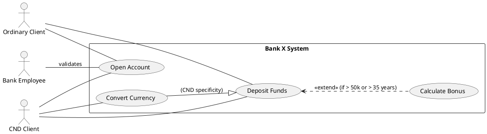
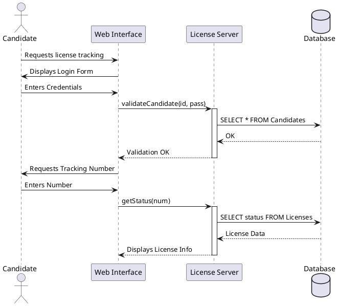

# 🏆 MASTER CORRECTION: MOCK EXAM 2 (SUBJECT 2)
**Theme: Sales, School Supplies & Banking**
**Objective: 50/50 points (Total Success)**

---

## 🧠 PART A: THEORY AND CONCEPTS (10 Points)

1. **Difference between HTML, CSS, and JS:**
   - **HTML:** Structures the content.
   - **CSS:** Manages presentation and design.
   - **JavaScript:** Manages interactivity and dynamic behaviors (e.g., pop-ups, calculations).

2. **Roles of Languages:**
   - **HTML:** Creation of semantic tags for text, links, and media.
   - **CSS:** Layout, fonts, colors, and responsiveness.

3. **Current Versions:** **HTML5** and **CSS3**.
4. **Role of JS in HTML:** DOM (Document Object Model) manipulation, client-side form validation, and asynchronous requests (AJAX).
5. **Digital vs. Traditional Marketing:**
   - **Digital:** Advertising on the internet, social media, SEO. Highly targeted, measurable, and interactive.
   - **Traditional:** TV, Radio, Press, Billboards. Mass-scale, expensive, and unidirectional.

6. **Advantages of Digital Marketing:** Ultra-precise targeting, real-time statistics, reduced cost, proximity to the customer.
7. **E-Commerce:** Buying and selling products or services via electronic networks (Internet). Objective: digitize the sales funnel.
8. **B2B vs. B2C:**
   - **B2B (Business to Business):** Company to Company.
   - **B2C (Business to Consumer):** Company to Individual.

9. **Key Terminologies:**
   - **Marketplace:** Platform connecting buyers and third-party sellers (e.g., Jumia, Amazon).
   - **Drop Shipping:** System where the seller has no stock and forwards the order to the supplier for direct delivery.

10. **PHP:** Hypertext Preprocessor. It is a **Server-Side** scripting language used to generate dynamic web pages by communicating with a database.

---

## 🎨 PART B: SECTION 1 - UML DESIGN (10 Points)

### 1.1 Use Case Diagram (Account Opening)


### 1.2 Sequence Diagram (License Tracking)


---

## 🗄️ SECTION 2: SQL MANIPULATION (10 Points)

### 2.1 Schema and Data
```sql
CREATE DATABASE sales_management;
USE sales_management;

CREATE TABLE Client (
    CliID VARCHAR(10) PRIMARY KEY,
    CliName VARCHAR(50),
    CliCity VARCHAR(50)
) ENGINE=InnoDB;

CREATE TABLE Product (
    ProdID VARCHAR(10) PRIMARY KEY,
    ProdName VARCHAR(100),
    ProdBrand VARCHAR(50),
    ProdPrice DECIMAL(10,2),
    StockQty INT
) ENGINE=InnoDB;

CREATE TABLE Sale (
    CliID VARCHAR(10),
    ProdID VARCHAR(10),
    SaleDate DATE,
    SaleQty INT,
    PRIMARY KEY (CliID, ProdID, SaleDate),
    FOREIGN KEY (CliID) REFERENCES Client(CliID),
    FOREIGN KEY (ProdID) REFERENCES Product(ProdID)
) ENGINE=InnoDB;
```

### 2.2 Advanced Queries
1. **Product brands:** `SELECT DISTINCT ProdBrand FROM Product;`
2. **IBM, Apple, or Asus products:** `SELECT * FROM Product WHERE ProdBrand IN ('IBM', 'Apple', 'Asus');`
3. **Clients who bought P1:** `SELECT DISTINCT C.CliName FROM Client C JOIN Sale S ON C.CliID = S.CliID WHERE S.ProdID = 'P1';`
4. **Products not purchased:** `SELECT ProdName FROM Product WHERE ProdID NOT IN (SELECT DISTINCT ProdID FROM Sale);`
5. **Greater than ALL C1 purchases:** 
```sql
SELECT DISTINCT CliName FROM Client C JOIN Sale S ON C.CliID = S.CliID 
WHERE S.SaleQty > ALL (SELECT SaleQty FROM Sale WHERE CliID = 'C1');
```
6. **Same city as C2:** `SELECT * FROM Client WHERE CliCity = (SELECT CliCity FROM Client WHERE CliID = 'C2') AND CliID != 'C2';`
7. **Cheaper than average:** `SELECT ProdName FROM Product WHERE ProdPrice < (SELECT AVG(ProdPrice) FROM Product);`
8. **Targeted deletion (Douala):** `DELETE FROM Sale WHERE CliID IN (SELECT CliID FROM Client WHERE CliCity = 'Douala') AND SaleDate < '2025-03-01';`

---

## 🌐 SECTION 3: DYNAMIC WEB (10 Points)

### 3.1 School Contact Form (ContactForm.php)
```php
<?php
$error = "";
$success = "";

if($_SERVER["REQUEST_METHOD"] == "POST") {
    $name = htmlspecialchars($_POST['name']);
    $email = $_POST['email'];
    
    if(filter_var($email, FILTER_VALIDATE_EMAIL)) {
        $success = "Thank you $name! Your request for the bookstore has been validated.";
    } else {
        $error = "The email address is invalid.";
    }
}
?>
<form method="POST" class="card p-4 shadow">
    <h3>Yaoundé Bookstore Contact</h3>
    <input type="text" name="name" class="form-control mb-2" placeholder="Full Name" required>
    <input type="text" name="neighborhood" class="form-control mb-2" placeholder="Your Neighborhood" required>
    <input type="tel" name="phone" class="form-control mb-2" placeholder="Phone (e.g.: 6XXXXXXXX)" required>
    <input type="email" name="email" class="form-control mb-2" placeholder="Email" required>
    <textarea name="message" class="form-control mb-2" placeholder="List of textbooks..."></textarea>
    <button type="submit" class="btn btn-primary">Send Order</button>
</form>
```

---

## ☕ SECTION 4: JAVA OOP (10 Points)

### Article.java Class (Expert)
```java
class InvalidCategoryException extends Exception {
    public InvalidCategoryException(String msg) { super(msg); }
}

public class Article {
    protected String code;
    protected String designation;
    protected double price;
    protected String category;

    public Article() { this.category = "IT"; }

    public Article(String code, String des, double p, String cat) throws InvalidCategoryException {
        this.code = code;
        this.designation = des;
        this.price = p;
        this.setCategory(cat);
    }

    public void setCategory(String cat) throws InvalidCategoryException {
        if(!cat.equals("IT") && !cat.equals("Office")) {
            throw new InvalidCategoryException("Invalid category!");
        }
        this.category = cat;
    }

    public double getPrice() { return this.price; }
    public void setPrice(double p) { this.price = p; }

    @Override
    public String toString() {
        return this.code + ";" + this.designation + ";" + this.price + ";" + this.category;
    }

    @Override
    public boolean equals(Object o) {
        if (this == o) return true;
        if (o == null || !(o instanceof Article)) return false;
        Article art = (Article) o;
        return code.equals(art.code) && designation.equals(art.designation) && price == art.price && category.equals(art.category);
    }
}
```
