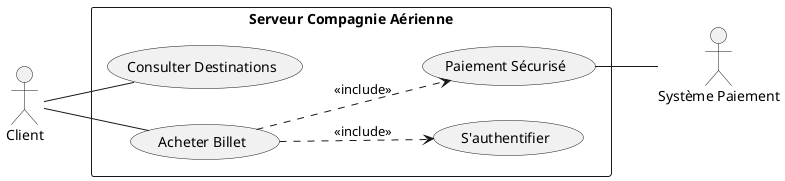
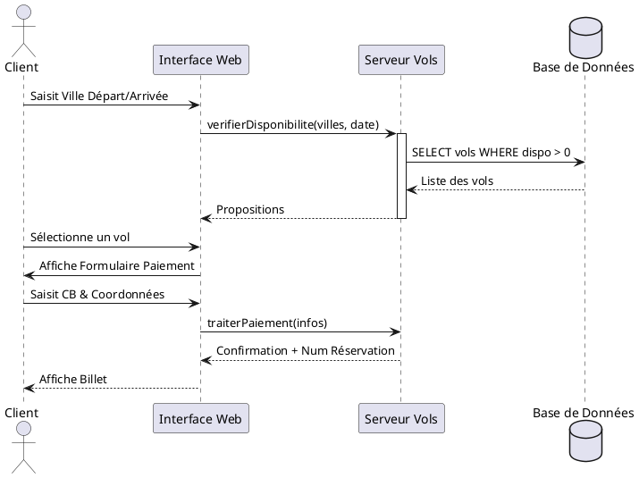

# 🏆 CORRECTION MAGISTRALE : EXAMEN BLANC 1 (SUJET 1)
**Thématique : Gestion Aérienne & Marketplace Maillots**
**Objectif : 50/50 points (Réussite Totale)**

---

## 🧠 PARTIE A : THÉORIE ET CONCEPTS (10 Points)

1. **Définitions Techniques :**
   - **HTML (HyperText Markup Language) :** Langage de balisage utilisé pour structurer le contenu d'une page web (titres, paragraphes, images).
   - **URL (Uniform Resource Locator) :** Adresse unique permettant de localiser une ressource sur internet (ex: https://www.google.com).
   - **CSS (Cascading Style Sheets) :** Langage de style permettant de gérer la mise en forme et le design (couleurs, polices, responsive).
   - **CMS (Content Management System) :** Logiciel permettant de créer et gérer un site web sans coder (ex: WordPress, PrestaShop).

2. **Services d'Internet :** Web (Navigation), Courrier électronique (Email), Transfert de fichiers (FTP), Messagerie instantanée.
3. **Site Web & Exemples :** Un ensemble de pages web liées entre elles et accessibles via un nom de domaine. *Exemples : Amazon.com, Wikipedia.org.*
4. **Composants d'une URL :** 1. Protocole (http/https), 2. Sous-domaine (www), 3. Nom de domaine (site.com), 4. Chemin/Ressource (/page.php).
5. **Squelette HTML :** `<html>`, `<head>`, `<title>`, `<body>`.
6. **Balises Tableau :** `<table>` (conteneur), `<tr>` (ligne), `<th>` (en-tête), `<td>` (cellule).
7. **Balises Formulaire :** `<form>`, `<input>`, `<textarea>`, `<button>`, `<label>`, `<select>`.
8. **Rôle du Local Storage :** Il permet de stocker des données (comme les articles d'un panier) de manière persistante sur le navigateur du client. Les données ne sont pas perdues à la fermeture du navigateur.
9. **Responsive E-commerce :** Utilisation de la balise `<meta name="viewport">`, des **Media Queries** CSS, et de frameworks comme **Bootstrap** (grilles fluides).
10. **Avantages du Commerce Électronique :**
    - *Entreprises :* Réduction des coûts physiques, vente 24h/24, accès à un marché mondial.
    - *Consommateurs :* Gain de temps, comparaison facile des prix, livraison à domicile.

---

## 🎨 PARTIE B : SECTION 1 - CONCEPTION UML (10 Points)

### 1.1 Diagramme de Cas d'Utilisation (Vente Billet)


### 1.2 Diagramme de Séquence (Acheter Billet)


---

## 🗄️ SECTION 2 : MANIPULATION SQL (10 Points)

### 2.1 Script de Création et Insertion
```sql
-- Création de la BDD
CREATE DATABASE db_aerien;
USE db_aerien;

-- Table Avion
CREATE TABLE Avion (
    NumAV INT PRIMARY KEY,
    NomAV VARCHAR(50),
    CapaciteAV INT,
    LocalisationAV VARCHAR(50)
) ENGINE=InnoDB;

-- Table Pilote
CREATE TABLE Pilote (
    NumPIL INT PRIMARY KEY,
    NomPIL VARCHAR(50),
    AdressePIL VARCHAR(100)
) ENGINE=InnoDB;

-- Table Vol
CREATE TABLE Vol (
    NumVOL VARCHAR(10) PRIMARY KEY,
    NumPIL INT,
    NumAV INT,
    VilleD VARCHAR(50),
    VilleA VARCHAR(50),
    HeureD TIME,
    HeureA TIME,
    FOREIGN KEY (NumPIL) REFERENCES Pilote(NumPIL),
    FOREIGN KEY (NumAV) REFERENCES Avion(NumAV)
) ENGINE=InnoDB;

-- Insertions (Jeu d'essai Sujet 1)
INSERT INTO Avion VALUES (100, 'AIRBUS', 300, 'RABAT'), (101, 'B737', 250, 'CASA'), (102, 'B737', 220, 'RABAT');
```

### 2.2 Résolution des Requêtes Examen
1. **Afficher tous les avions :** `SELECT * FROM Avion;`
2. **Tri croissant sur le nom :** `SELECT * FROM Avion ORDER BY NomAV ASC;`
3. **Localisations sans redondance :** `SELECT DISTINCT LocalisationAV FROM Avion;`
4. **Modification capacité :** `UPDATE Avion SET CapaciteAV = 220 WHERE NumAV = 101;`
5. **Suppression capacité < 200 :** `DELETE FROM Avion WHERE CapaciteAV < 200;`
6. **Agrégations :** `SELECT MAX(CapaciteAV), MIN(CapaciteAV), AVG(CapaciteAV) FROM Avion;`
7. **Capacité la plus basse :** `SELECT * FROM Avion WHERE CapaciteAV = (SELECT MIN(CapaciteAV) FROM Avion);`
8. **Capacité > Moyenne :** `SELECT * FROM Avion WHERE CapaciteAV > (SELECT AVG(CapaciteAV) FROM Avion);`
9. **Pilotes AIRBUS en service :**
```sql
SELECT DISTINCT P.NomPIL 
FROM Pilote P
JOIN Vol V ON P.NumPIL = V.NumPIL
JOIN Avion A ON V.NumAV = A.NumAV
WHERE A.NomAV = 'AIRBUS';
```

---

## 🌐 SECTION 3 : WEB DYNAMIQUE (10 Points)

### 3.1 Fichier index.php (Fusion Marketplace)
```php
<?php
// Traitement FormContact.php
$msg_success = "";
if($_SERVER["REQUEST_METHOD"] == "POST") {
    $email = $_POST['email'];
    if(filter_var($email, FILTER_VALIDATE_EMAIL)) {
        $msg_success = "Message envoyé avec succès !";
    }
}

$maillots = [
    ['id' => 1, 'nom' => 'Maillot Cameroun', 'prix' => 25000, 'img' => 'cmr.jpg'],
    ['id' => 2, 'nom' => 'Maillot France', 'prix' => 30000, 'img' => 'fra.jpg'],
    ['id' => 3, 'nom' => 'Maillot Argentine', 'prix' => 35000, 'img' => 'arg.jpg'],
];
?>
<!DOCTYPE html>
<html>
<head>
    <meta charset="UTF-8">
    <meta name="description" content="Vente de maillots officiels BTS">
    <title>Empire Maillots</title>
    <link href="https://cdn.jsdelivr.net/npm/bootstrap@5.3.0/dist/css/bootstrap.min.css" rel="stylesheet">
</head>
<body class="p-4">
    <nav class="navbar bg-dark navbar-dark mb-4">
        <div class="container">
            <a class="navbar-brand" href="#">Boutique Maillots</a>
            <input type="text" id="search" placeholder="Rechercher un club...">
            <a href="ListeMaillots.php" class="btn btn-primary">Voir Stock</a>
            <span class="badge bg-danger" id="cart-count">0</span>
        </div>
    </nav>

    <?php if($msg_success) echo "<div class='alert alert-success'>$msg_success</div>"; ?>

    <div class="row">
        <?php foreach($maillots as $m): ?>
        <div class="col-md-4">
            <div class="card">
                " class="card-img-top">
                <div class="card-body">
                    <h5><?= $m['nom'] ?></h5>
                    <p><?= $m['prix'] ?> FCFA</p>
                    <button class="btn btn-success" onclick="addToCart(<?= $m['id'] ?>, '<?= $m['nom'] ?>', <?= $m['prix'] ?>)">Ajouter</button>
                </div>
            </div>
        </div>
        <?php endforeach; ?>
    </div>

    <script src="Maillot.js"></script>
</body>
</html>
```

---

## ☕ SECTION 4 : JAVA POO (10 Points)

### Classe Account.java
```java
public class Account {
    private double solde;
    private String titulaire;

    // Constructeur par défaut
    public Account() {
        this.solde = 0.0;
    }

    // Constructeur avec balance initiale
    public Account(double balanceInitial) {
        this.solde = (balanceInitial >= 0) ? balanceInitial : 0.0;
    }

    public double getBalance() {
        return this.solde;
    }

    public void deposer(double montant) {
        if (montant > 0) this.solde += montant;
    }

    public void retirer(double montant) {
        if (montant > 0 && this.solde >= montant) {
            this.solde -= montant;
        }
    }

    public void ajouterInteret(double taux) {
        // Formule Sujet 1 : Solde * (1 + Taux)
        this.solde = this.solde * (1 + taux);
    }
}
```
