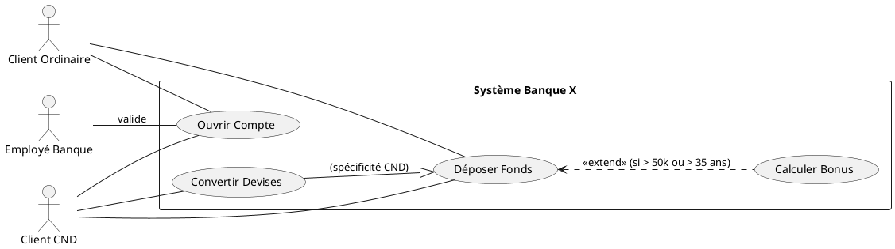
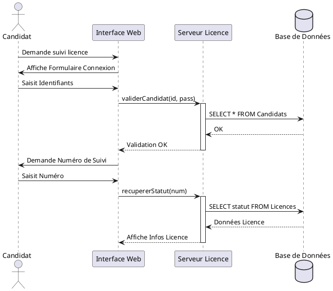

# 🏆 CORRECTION MAGISTRALE : EXAMEN BLANC 2 (SUJET 2)
**Thématique : Ventes, Fournitures Scolaires & Banque**
**Objectif : 50/50 points (Réussite Totale)**

---

## 🧠 PARTIE A : THÉORIE ET CONCEPTS (10 Points)

1. **Différence HTML, CSS et JS :**
   - **HTML :** Structure le contenu.
   - **CSS :** Gère la présentation et le design.
   - **JavaScript :** Gère l'interactivité et les comportements dynamiques (ex: pop-up, calculs).

2. **Rôles des Langages :**
   - **HTML :** Création de balises sémantiques pour le texte, liens et médias.
   - **CSS :** Mise en page, polices, couleurs et adaptabilité (responsive).

3. **Versions Actuelles :** **HTML5** et **CSS3**.
4. **Rôle de JS dans HTML :** Manipulation du DOM (Document Object Model), validation de formulaires côté client, et requêtes asynchrones (AJAX).
5. **Marketing Digital vs Traditionnel :**
   - **Digital :** Publicité sur internet, réseaux sociaux, SEO. Très ciblé, mesurable et interactif.
   - **Traditionnel :** TV, Radio, Presse, Affichage. Massif, coûteux et unidirectionnel.

6. **Avantages du Marketing Digital :** Ciblage ultra-précis, statistiques en temps réel, coût réduit, proximité avec le client.
7. **E-Commerce :** Vente et achat de produits ou services via des réseaux électroniques (Internet). Objectif : numériser le tunnel de vente.
8. **B2B vs B2C :**
   - **B2B (Business to Business) :** Entreprise à Entreprise.
   - **B2C (Business to Consumer) :** Entreprise vers Particulier.

9. **Terminologies Clés :**
   - **Marketplace :** Plateforme mettant en relation acheteurs et vendeurs tiers (ex: Jumia, Amazon).
   - **Drop Shipping :** Système où le vendeur n'a pas de stock et transmet la commande au fournisseur pour livraison directe.

10. **PHP :** Hypertext Preprocessor. C'est un langage de script **Côté Serveur** utilisé pour générer des pages web dynamiques en communiquant avec une base de données.

---

## 🎨 PARTIE B : SECTION 1 - CONCEPTION UML (10 Points)

### 1.1 Diagramme de Cas d'Utilisation (Ouverture Compte)


### 1.2 Diagramme de Séquence (Suivi Licence)


---

## 🗄️ SECTION 2 : MANIPULATION SQL (10 Points)

### 2.1 Schéma et Données
```sql
CREATE DATABASE gestionVentes;
USE gestionVentes;

CREATE TABLE Client (
    IdCli VARCHAR(10) PRIMARY KEY,
    NomCli VARCHAR(50),
    VilleCli VARCHAR(50)
) ENGINE=InnoDB;

CREATE TABLE Produit (
    IdProd VARCHAR(10) PRIMARY KEY,
    NomP VARCHAR(100),
    MarqueP VARCHAR(50),
    PrixP DECIMAL(10,2),
    QteStockP INT
) ENGINE=InnoDB;

CREATE TABLE Vente (
    IdCli VARCHAR(10),
    IdProd VARCHAR(10),
    DateV DATE,
    QteV INT,
    PRIMARY KEY (IdCli, IdProd, DateV),
    FOREIGN KEY (IdCli) REFERENCES Client(IdCli),
    FOREIGN KEY (IdProd) REFERENCES Produit(IdProd)
) ENGINE=InnoDB;
```

### 2.2 Requêtes Avancées
1. **Marques de produits :** `SELECT DISTINCT MarqueP FROM Produit;`
2. **Produits IBM, Apple ou Asus :** `SELECT * FROM Produit WHERE MarqueP IN ('IBM', 'Apple', 'Asus');`
3. **Clients ayant acheté P1 :** `SELECT DISTINCT C.NomCli FROM Client C JOIN Vente V ON C.IdCli = V.IdCli WHERE V.IdProd = 'P1';`
4. **Produits non achetés :** `SELECT NomP FROM Produit WHERE IdProd NOT IN (SELECT DISTINCT IdProd FROM Vente);`
5. **Supérieur à TOUS les achats de C1 :** 
```sql
SELECT DISTINCT NomCli FROM Client C JOIN Vente V ON C.IdCli = V.IdCli 
WHERE V.QteV > ALL (SELECT QteV FROM Vente WHERE IdCli = 'C1');
```
6. **Même ville que C2 :** `SELECT * FROM Client WHERE VilleCli = (SELECT VilleCli FROM Client WHERE IdCli = 'C2') AND IdCli != 'C2';`
7. **Moins cher que la moyenne :** `SELECT NomP FROM Produit WHERE PrixP < (SELECT AVG(PrixP) FROM Produit);`
8. **Suppression ciblée (Douala) :** `DELETE FROM Vente WHERE IdCli IN (SELECT IdCli FROM Client WHERE VilleCli = 'Douala') AND DateV < '2025-03-01';`

---

## 🌐 SECTION 3 : WEB DYNAMIQUE (10 Points)

### 3.1 Formulaire de Contact Scolaire (FormulaireContact.php)
```php
<?php
$erreur = "";
$succes = "";

if($_SERVER["REQUEST_METHOD"] == "POST") {
    $nom = htmlspecialchars($_POST['nom']);
    $email = $_POST['email'];
    
    if(filter_var($email, FILTER_VALIDATE_EMAIL)) {
        $succes = "Merci $nom ! Votre demande pour la librairie est validée.";
    } else {
        $erreur = "L'adresse email est invalide.";
    }
}
?>
<form method="POST" class="card p-4 shadow">
    <h3>Contact Librairie Yaoundé</h3>
    <input type="text" name="nom" class="form-control mb-2" placeholder="Nom complet" required>
    <input type="text" name="quartier" class="form-control mb-2" placeholder="Votre Quartier" required>
    <input type="tel" name="tel" class="form-control mb-2" placeholder="Téléphone (ex: 6XXXXXXXX)" required>
    <input type="email" name="email" class="form-control mb-2" placeholder="Email" required>
    <textarea name="message" class="form-control mb-2" placeholder="Liste des manuels..."></textarea>
    <button type="submit" class="btn btn-primary">Envoyer la commande</button>
</form>
```

---

## ☕ SECTION 4 : JAVA POO (10 Points)

### Classe Article.java (Expert)
```java
class CategorieInvalideException extends Exception {
    public CategorieInvalideException(String msg) { super(msg); }
}

public class Article {
    protected String code;
    protected String designation;
    protected double prix;
    protected String categorie;

    public Article() { this.categorie = "Informatique"; }

    public Article(String code, String des, double p, String cat) throws CategorieInvalideException {
        this.code = code;
        this.designation = des;
        this.prix = p;
        this.setCategorie(cat);
    }

    public void setCategorie(String cat) throws CategorieInvalideException {
        if(!cat.equals("Informatique") && !cat.equals("Bureautique")) {
            throw new CategorieInvalideException("Catégorie invalide !");
        }
        this.categorie = cat;
    }

    public double getPrix() { return this.prix; }
    public void setPrix(double p) { this.prix = p; }

    @Override
    public String toString() {
        return this.code + ";" + this.designation + ";" + this.prix + ";" + this.categorie;
    }

    @Override
    public boolean equals(Object o) {
        if (this == o) return true;
        if (o == null || !(o instanceof Article)) return false;
        Article art = (Article) o;
        return code.equals(art.code) && designation.equals(art.designation) && prix == art.prix && categorie.equals(art.categorie);
    }
}
```
